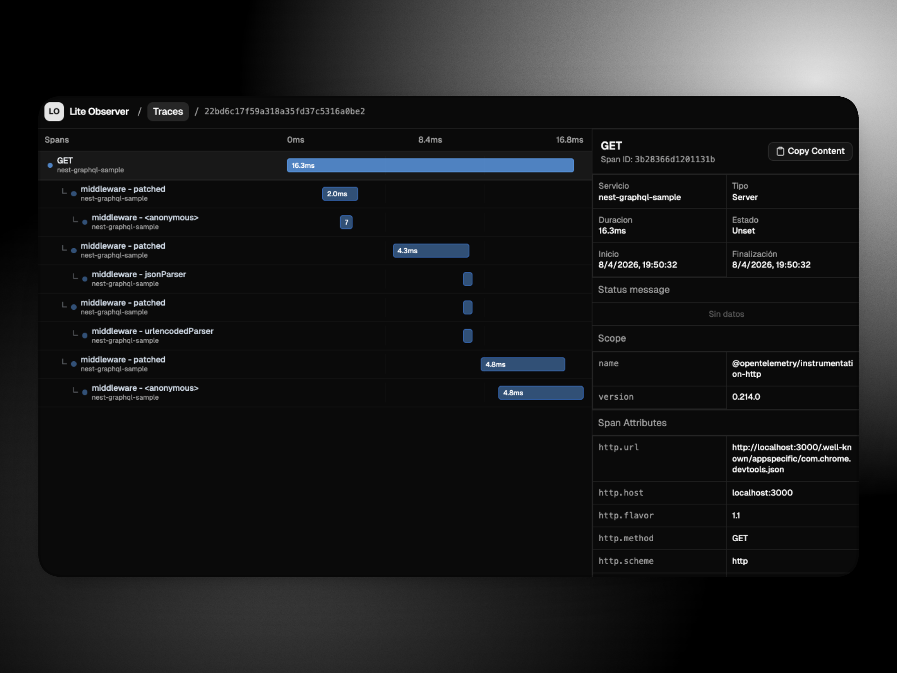

# 🔍 Lite Observer

A lightweight, local-first OpenTelemetry trace explorer. Point your OTLP exporter at it, open the UI, and understand what your services are doing — without running a full Jaeger or Tempo stack.



## What it does

Lite Observer accepts OpenTelemetry trace exports over HTTP, stores them in a local PostgreSQL database, and provides a web UI to browse, filter, and inspect them.

- **Trace list** — scan recent traces across services with duration, span count, and status at a glance
- **Search and filters** — narrow by name and outcome (success / error / unset)
- **Trace detail** — see how spans relate in hierarchy and on a relative timeline
- **Span inspection** — review attributes, resource metadata, events, and links; copy any span as JSON
- **Automatic retention** — old traces are purged on a configurable schedule so the database stays small

> Metrics and logs pipelines are implemented in the codebase but not yet exposed. Traces are the primary experience in this release.

## 🚀 Quick start

**Prerequisites:** [Docker](https://docs.docker.com/get-docker/) and Docker Compose.

```bash
git clone https://github.com/your-username/lite-observer.git
cd lite-observer
docker compose up -d
```

| Service | Default URL |
| --- | --- |
| UI | http://localhost:3000 |
| Trace collector (OTLP/HTTP) | http://localhost:3001/v1/traces |
| API | http://localhost:3001 |

## 🐾 Send your first trace

Configure your OpenTelemetry SDK to export over HTTP and point it at the collector:

```js
// Node.js example using @opentelemetry/exporter-trace-otlp-http
import { OTLPTraceExporter } from '@opentelemetry/exporter-trace-otlp-http';

const exporter = new OTLPTraceExporter({
  url: 'http://localhost:3001/v1/traces',
});
```

For other languages or frameworks, set the OTLP HTTP endpoint to `http://localhost:3001/v1/traces`. The collector accepts the standard OTLP JSON format.

## ⛴️ Port conflicts

If any of the default ports are already in use on your machine, create a `.env` file in the project root before running `docker compose up`:

```bash
cp .env.sample .env
# edit .env and change the ports that conflict
docker compose up -d
```

Available variables and their defaults:

| Variable | Default | Description |
| --- | --- | --- |
| `FRONTEND_PORT` | `3000` | Port for the web UI on your machine |
| `BACKEND_PORT` | `3001` | Port for the API and collector on your machine |
| `POSTGRES_PORT` | `5433` | Port for PostgreSQL on your machine |

> [!Note]
> If you change `BACKEND_PORT`, you need to rebuild the frontend so the UI is compiled with the correct API URL: `docker compose build frontend && docker compose up -d`, and also you need to change the url used on the OTLPTraceExporter.

## Useful commands

```bash
# Start all services in the background
docker compose up -d

# Follow logs from all services
docker compose logs -f

# Follow logs from a single service
docker compose logs -f backend

# Stop all services (data is preserved)
docker compose stop

# Stop and remove containers (data is preserved in the Docker volume)
docker compose down

# Stop, remove containers, and wipe all stored data
docker compose down -v
```

## How it works

```
Your app  ──OTLP/HTTP──▶  Backend (Fastify)  ──▶  PostgreSQL
                                │
                           REST API
                                │
                         Frontend (React)
```

- **Backend** — Fastify 5 + TypeScript. Receives OTLP trace payloads, normalises them into span rows, applies migrations on startup, and serves the query API. Runs automatic retention cleanup every hour.
- **Frontend** — React 19 + Vite + Tailwind CSS. Served as a static build via nginx inside the container.
- **Database** — PostgreSQL 17. Spans are indexed by trace id, service name, start time, and status for fast filtering.

## Contributing

See [backend/README.md](./backend/README.md) and [frontend/README.md](./frontend/README.md) for setup instructions without Docker (useful when working on the code itself).
